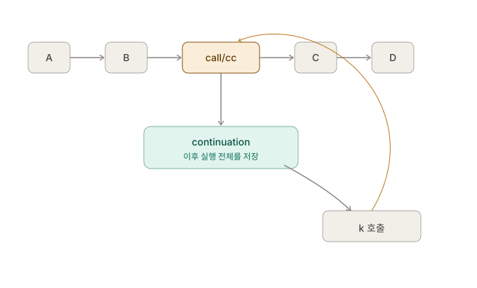

지난 글에서 continuation을 개념적으로 살파보았다면, 이번에는 실제 실행 흐름을 추적해보자.

Scheme 표준은 continuation을 **현재 계산의 미래 전체를 나타내는 것**으로 설명하고, `call/cc`는 그것을 procedure 형태로 포장해서 넘긴다고 설명한다. ([standards.scheme.org][1])


## `call/cc` 없는 세계

먼저 이걸 보자.

```scheme
(+ 10 (* 2 3))
```

이 코드의 실행 순서를 아주 기계적으로 생각해보자.

```text
(+ 10 (* 2 3))
       │
       ▼
    (* 2 3)
       │
       ▼
       6
```

그런데 `2`와 `3`을 곱셈하여 `6`을 얻었다고 끝난 게 아니다.

프로그램은 중간 결과물인 **6을 가지고 뭘 해야 하는가?**

```scheme
(+ 10 6)
```

그리고:

```text
16
```

이다.

여기서 중요한 것은 이것이다.

```text
(* 2 3)
   │
   │ 결과가 6이면
   ▼
(+ 10 6)
   │
   ▼
  16
```

`(* 2 3)`의 관점에서 보면,

> "내가 값을 하나 반환하면 그 값을 받아서 `(+ 10 ...)`을 계산하고, 그 결과를 또 바깥으로 넘겨야 한다."

이 **뒤에 남아 있는 모든 계산**이 continuation이다.


## 내 삶에 continuation을 영접하자

위의 코드를 이렇게 바꿔 생각해보자.

```scheme
(+ 10 (* 2 3))
```

`(* 2 3)`을 `X`라고 놓으면:

```scheme
(+ 10 X)
```

이걸 함수로 만들면:

```scheme
(lambda (X)
  (+ 10 X))
```

바로 이것이 그 순간의 continuation이다.

그러니까:

```scheme
(* 2 3)
```

의 continuation은:

```scheme
(lambda (x)
  (+ 10 x))
```

이다.

그리고 이걸 호출하면:

```scheme
(k 6)
```

그래서 결과는:

```scheme
(+ 10 6)
```

즉:

```text
16
```

이다. 

여기까지는 별로 두렵지 않다. 우리가 늘 봐 오던 것들이다.

**자 조금 더 안쪽으로 들어가 보자.**

이번에는:

```scheme
(* 2 (+ 10 5))
```

이다.

`(+ 10 5)`의 결과는 `15`.

그러면 바깥에서는:

```scheme
(* 2 15)
```

를 해야 한다.

따라서 continuation은:

```scheme
(lambda (x)
  (* 2 x))
```

이다.

즉:

```text
   현재
    ↓
(+ 10 5)
    │
    │ 15
    ▼
(* 2 15)
    │
    ▼
   30
```

continuation은:

```scheme
(lambda (x)
  (* 2 x))
```

이다.

**이제 `call/cc`를 집어넣는다.**

다음 코드를 보자.

```scheme
(* 2
   (call/cc
     (lambda (k)
       10)))
```

여기서 `call/cc`가 실행되는 순간을 멈춰보자.

현재 프로그램은:

```scheme
(* 2 [여기])
```

이다.

그러므로 현재 continuation은:

```scheme
(lambda (x)
  (* 2 x))
```

이다.

`call/cc`는 바로 이것을 잡아낸다. 마치 스크린샷을 찍듯이 자신을 둘러싼 외부 상태를 캡쳐하는 것이다.

그리고:

```scheme
(lambda (k)
  10)
```

에 넘겨준다.

즉 머릿속으로 이렇게 생각하면 된다.

```text
call/cc
  │
  ├── 현재 continuation을 캡처
  │
  │     k = (lambda (x)
  │            (* 2 x))
  │
  └── (lambda (k) 10)에 k를 전달
```

그런데 lambda가 그냥 `10`을 반환했으므로:

```scheme
(* 2 10)
```

이 되고, 최종 결과는:

```text
20
```

이다.

## continuation의 호출

그런데 `k`를 호출하면? 무슨 일이 일어날까?

이번에는:

```scheme
(* 2
   (call/cc
     (lambda (k)
       (k 10))))
```

이다.

여기도 마찬가지로 `call/cc`가 continuation을 캡처한다.

```scheme
k
=
(lambda (x)
  (* 2 x))
```

그리고:

```scheme
(k 10)
```

와 같이 호출한다.

그런데 이걸 **일반 함수 호출이라고 생각하면 안 된다.**

`k`는 이렇게 말한다.

> "내가 캡처했을 때의 continuation으로 돌아가서, 거기에 `10`을 넣어."

즉:

```text
(k 10)
  │
  │ 현재 실행 중인 것을 버림
  │
  ▼
(* 2 10)
  │
  ▼
20
```

이다.

## 함수와 continuation

** 이 시점에서 일반적인 함수 호출과 다르다는 걸 느껴야 정상이다.**

이 코드를 보자.

```scheme
(* 2
   (call/cc
     (lambda (k)
       (k 10))))
```

보통 함수 호출이라면:

```scheme
(k 10)
```

을 했으니 `k`가 끝나고 그 다음으로 진행할 것 같다.

하지만 아니다.

`k`를 호출하는 순간 **현재 continuation이 버려진다.**

그리고 `call/cc`를 호출했던 당시의 continuation이 복원된다.

즉:

```text
현재 실행 흐름

(* 2
   call/cc
     lambda
       k 10   ← 여기서 갑자기
         ↓
         
저장해 두었던 실행 흐름

(* 2 10)
     ↓
    20
```

으로 간다.

Scheme 표준의 표현을 그대로 빌리면, 나중에 escape procedure를 호출하면 **그 시점의 continuation을 버리고 continuation이 만들어졌던 당시의 continuation을 다시 사용한다.** ([standards.scheme.org][1])



이것을 게임으로 표현하면 던전에서 몬스터와 싸우다가 상황이 불리해지자 갑자기 마을로 돌아가는 포털 마법을 쓴 것과 같다.
우리는 이미 디아블로에서 이런 것을 많이 해 오지 않았던가. 
지하 5층에서 내려왔던 길로 돌아가는 것이 아니라 마법이나 스크롤을 사용해서 마을로 바로 복귀하는 것 말이다.

## continuation의 재활용

이제 다른 언어의 만든 코드와는 완전히 다른, 이상한 예제를 보자.

다음의 코드다.

```scheme
(define saved #f)

(define result
  (+ 100
     (call/cc
       (lambda (k)
         (set! saved k)
         1))))

(display result)
```

일단 처음 실행하면:

```text
101
```

이다.

그런데 `saved`에는 무엇이 들어 있을까?

바로 이 continuation이다.

```scheme
(lambda (x)
  (+ 100 x))
```

즉:

```text
call/cc를 실행했던 순간:

  (+ 100 [여기])
            ↑
            │
            k
```

그리고 나중에 `saved`를 호출하면, 

예를 들어:

```scheme
(saved 999)
```

을 실행한다고 해보자. 그러면 무슨 일이 벌어질까? 

현재 프로그램은 이미 다른 곳에서 실행 중에 있다. 그런데:

```scheme
(saved 999)
```

하는 순간:

```text
현재 위치
   │
   │ 버림
   ▼
------------------

saved가 기억하고 있던 곳

(+ 100 [999])
      │
      ▼
    1099
```

가 된다.

즉 `saved`는 단순히:

```scheme
(lambda (x)
  (+ 100 x))
```

같은 함수가 **아니다.** 그 함수가 실행되는 위치와 주변 실행 상태까지 포함한 **프로그램의 진행 경로**를 가지고 있다. 이것이 continuation이다. 
**그래서 "함수"라고 설명하면 절반만 맞다.*

continuation은 Scheme에서 procedure처럼 **표현되지만**, 개념적으로는 단순한 함수보다 훨씬 크다.

예를 들어:

```scheme
(lambda (x)
  (+ 100 x))
```

라는 일반 함수는:

> x를 받아서 100을 더한다.

이다.

하지만 continuation은:

> **이 시점에서 결과가 나오면, 프로그램을 어떻게 계속 진행해야 하는가**

에 대한 정보다.

그래서 continuation은 사실상:

```text
현재 실행 위치
+ 이후에 수행할 계산
+ 필요한 환경
+ 프로그램을 계속 진행시키는 방법
```

이라고 생각하는 게 좋다.

## return과 continuation

이걸 함수의 `return`과 비교하면 아주 재미있다.

C/Rust의:

```rust
fn foo() -> i32 {
    println!("A");
    return 42;
    println!("B");
}
```

에서 `return`을 만나면:

```text
현재 함수
   │
   ├─ A
   │
   └─ return 42
          │
          ▼
      호출자에게 복귀
```

한다.

그런데 `call/cc`는 이걸 훨씬 일반화한다.

```text
현재 continuation
        │
        ▼
     k라는 값으로 저장
        │
        ├──────────────┐
        │              │
      지금 실행       나중에 실행
        │              │
        │              ▼
        │           (k value)
        │              │
        └──────────────┘
                       │
                       ▼
                 저장된 지점으로
                 실행 흐름 복귀
```

즉 `return`은 **현재 함수의 정해진 호출자에게 돌아가는 특수한 control flow**이고,

`call/cc`는:

> **"현재의 돌아갈 길 자체를 값으로 뽑아서 내가 보관하겠다."**

이다.

**그런데 더 놀라운 일이 가능하다.* continuation은 **한 번만 사용할 필요도 없다.** 

예를 들어 개념적으로:

```scheme
(define saved-k #f)

(+ 10
   (call/cc
     (lambda (c)
       (set! saved-k c)
       20)))
```

처음에는:

```text
30
```

이 된다.

그런데 `saved-k`를 가지고 있다가:

```scheme
(saved-k 100)
```

하면:

```text
110
```

이 된다.

그리고 다시:

```scheme
(saved-k 500)
```

하면:

```text
510
```

처럼 **같은 continuation을 다시 사용할 수 있다.**

R7RS의 `call/cc`로 만들어진 escape procedure는 일반 procedure처럼 저장할 수 있고, 여러 번 호출할 수 있다고 명시되어 있다. ([standards.scheme.org][2])

이 지점이 `call/cc`가 단순한 `return`과 완전히 다른 점이다.


## 세이브 포인트

그리고 여기서 "시간을 저장한다"는 느낌이 생긴다. 
지난 글에서 비유했듯이 continuation을 이해하는 데 가장 좋은 비유라고 생각하는 것은 **게임 세이브 포인트**이다.

게임을 하다가:

```text
현재 상태
 ├─ 플레이어 위치
 ├─ HP
 ├─ 인벤토리
 ├─ 퀘스트 상태
 └─ 앞으로 진행할 게임 흐름
```

을 저장했다고 하자. 그리고 계속 게임을 진행한다. 그런데 나중에 세이브를 불러오면:

```text
현재 게임
   │
   │ 폐기
   ▼
세이브했던 시점
   │
   ▼
그때부터 다시 진행
```

한다.

continuation도 이와 비슷하다.

단, 저장하는 것은 단순히 변수들의 값만이 아니라:

> **"프로그램이 여기서부터 어떻게 계속되어야 하는가"**

이다.

그래서 다른 프로그래머에게 continuation을 처음 이해할 때는 **"실행 상태의 스냅샷"보다는 "프로그램의 미래를 저장한 것"**이라고 생각하라고 권하고 싶다.

Scheme 표준도 바로 이 관점에서 continuation을 "entire (default) future for the computation"이라고 설명한다. ([standards.scheme.org][1])


## 캡쳐와 치환 

이제 다음 코드를 보자.

```scheme
(+ 1
   (* 2
      (call/cc
        (lambda (k)
          (k 10)))))
```

여기서 `k`가 무엇일까?

`call/cc` 위치를 `[HERE]`라고 하면:

```scheme
(+ 1
   (* 2
      [HERE]))
```

따라서 continuation은:

```scheme
(lambda (x)
  (+ 1
     (* 2 x)))
```

이다.

그래서:

```scheme
(k 10)
```

은 사실상:

```scheme
(+ 1
   (* 2 10))
```

을 실행시키는 것이다.

결과:

```text
21
```

이다. **이것이 continuation을 이해하는 핵심 개념이다.**

**앞으로 `call/cc`를 볼 때 이렇게 하면 된다.**

코드에서:

```scheme
(call/cc
  (lambda (k)
    ...))
```

를 발견하면 **무조건 잠깐 멈추자.**

그리고 `call/cc`를 `[HERE]`로 바꾼다.

예를 들어:

```scheme
(+ 1
   (* 2
      (call/cc
        (lambda (k)
          ...))))
```

를:

```scheme
(+ 1
   (* 2
      [HERE]))
```

로 바꾼다.

그러면 `[HERE]`의 continuation은:

```scheme
(lambda (x)
  (+ 1
     (* 2 x)))
```

이다.

그리고 `k`가 바로 **이 continuation을 나타내는 값**이다.

따라서:

```scheme
(k 10)
```

은:

```scheme
(+ 1
   (* 2 10))
```

으로 **프로그램의 실행 흐름을 되돌리는 것**이다.

여기까지 따라잡았다면 이제 `call/cc`의 절반 이상은 잡은 거라고 봐도 좋다. 정말이다.

다음 글에서는 `call/cc`를 가지고 실용적인 코드를 만들어보면서 실제로 continuation이 프로그램 내에서 어떤 방식으로 사용되는지를 살펴보자.
**`call/cc`로 간단한 `return`을 직접 구현한 다음 → 예외 처리 → backtracking → coroutine** 순으로 가보고 싶은데,
내가 그 정도 역량이 될지는 모르겠다.

[1]: https://standards.scheme.org/r7rs-html5/index.html?utm_source=monpetit.github.io "Revised^7 Report on the Algorithmic Language Scheme"
[2]: https://standards.scheme.org/corrected-r7rs/r7rs-Z-H-8.html?utm_source=monpetit.github.io "Revised^7 Report on the Algorithmic Language Scheme"
