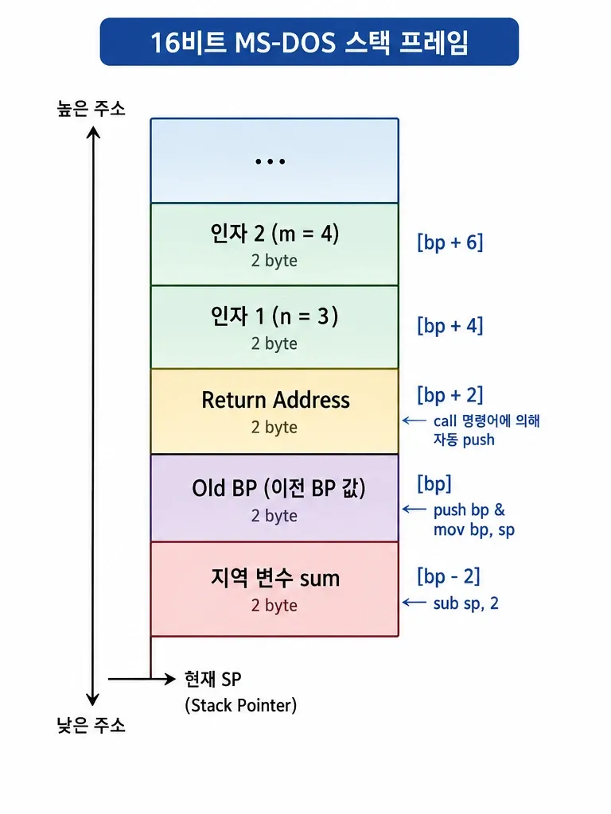
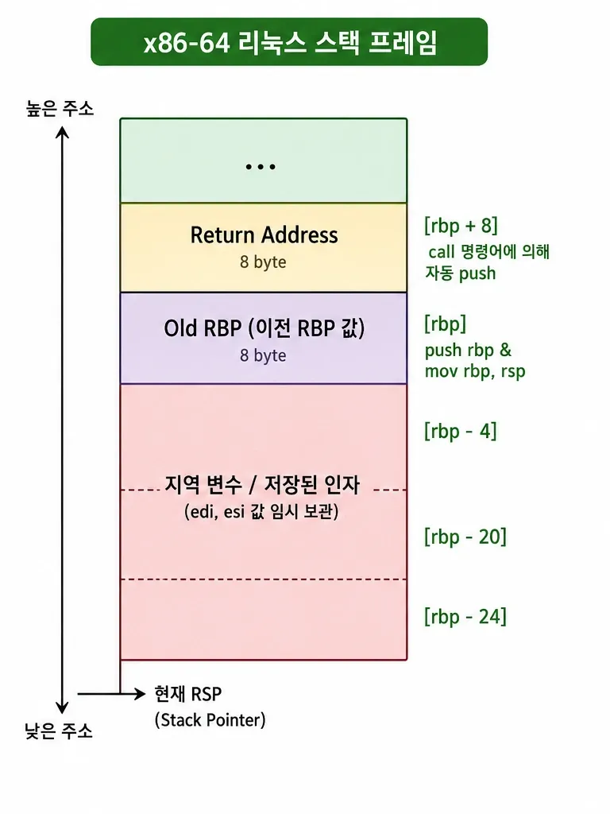

오늘 오랜만에 Dosbox를 가지고 놀다가 문득 이런 생각이 들었다.
옛날에는 16비트에서도 레지스터가 부족하다는 생각을 별로 못했는데, 64비트가 일상화된 지금으로서는 16비트 세상에서는 어떻게 살았나 하는 생각이 들었다.
그래서 아무런 쓸모도 없지만, 16비트와 64비트의 호출 규약, 레지스터 및 메모리 접근, 시스템 콜 같은 것들이 얼마나 차이가 날지
비교해 보기 위해 초간단 프로그램을 어셈블리로 만들어 보았다.

정말로 간단한 프로그램이다. 심지어 콘솔에 출력도 없다. 두 정수를 더하고, 제곱하는 프로그램이다.
어섬블러는 FASM을 썼다.

## 16비트와 64비트

우선 MS-DOS용으로 ADD & SQUARE 함수를 구현하고 호출해 보았다.

```assembly
; =========================================================================
; MS-DOS용 FASM (16비트 Real Mode .COM 파일)
; =========================================================================

org 100h                    ; DOS COM 파일 시작점 지정
use16                       ; 16비트 리얼 모드 코드 지정

; -------------------------------------------------------------------------
; main 함수: 프로그램의 시작점
; -------------------------------------------------------------------------
start:                      ; 프로그램 진입점 라벨
    ; result = add(3, 4); 구현
    push word 4             ; add 함수 두 번째 인자(m = 4)를 스택에 넣음
    push word 3             ; add 함수 첫 번째 인자(n = 3)를 스택에 넣음
    call add_func           ; add_func 함수 호출 (명령어 'add'와의 이름 충돌 방지)
    add sp, 4               ; 호출자(main)에서 스택 인자(4바이트) 정리
    mov [result], ax        ; add_func 함수의 반환값(AX = 7)을 변수 result에 저장

    ; result = square(result); 구현
    push word [result]      ; square 함수 인자(result = 7)를 스택에 넣음
    call square             ; square 함수 호출 (반환값은 AX 레지스터에 저장됨)
    add sp, 2               ; 호출자(main)에서 스택 인자(2바이트) 정리
    mov [result], ax        ; square 함수의 반환값(AX = 49)을 변수 result에 저장

    ; return result; 및 DOS 종료 처리
    mov ah, 4Ch             ; DOS 프로그램 종료 서비스 번호(4CH) 설정
    mov al, byte [result]   ; exit code(반환값)로 result의 하위 1바이트 전달
    int 21h                 ; DOS 시스템 콜 호출하여 프로그램 종료

; -------------------------------------------------------------------------
; square 함수: int square(int num)
; -------------------------------------------------------------------------
square:
    push bp                 ; 이전 베이스 포인터(BP)를 스택에 보존
    mov bp, sp              ; 현재 스택 포인터(SP)를 베이스 포인터(BP)로 설정하여 프레임 생성

    mov ax, [bp+4]          ; 첫 번째 인자인 num(7)을 AX 레지스터로 복사
    imul word [bp+4]        ; AX = AX * num (7 * 7 = 49 계산, 부호 있는 곱셈)

    pop bp                  ; 보존해 두었던 이전 BP 값을 복원
    ret                     ; 함수를 호출한 곳으로 복귀 (반환값은 AX에 유지됨)

; -------------------------------------------------------------------------
; add 함수: int add(int n, int m) -> add_func로 명칭 변경
; -------------------------------------------------------------------------
add_func:
    push bp                 ; 이전 베이스 포인터(BP)를 스택에 보존
    mov bp, sp              ; 현재 스택 포인터(SP)를 베이스 포인터(BP)로 설정하여 프레임 생성
    sub sp, 2               ; 지역 변수 'sum'을 위한 공간(2바이트)을 스택에 할당 [bp-2]

    mov ax, [bp+4]          ; AX 레지스터에 첫 번째 인자 n(3) 입력
    add ax, [bp+6]          ; AX 레지스터에 두 번째 인자 m(4)을 더함 (AX = 7)
    mov [bp-2], ax          ; 덧셈 결과(7)를 지역 변수 sum [bp-2] 공간에 저장

    mov ax, [bp-2]          ; 반환값으로 전달하기 위해 sum의 값을 반환용 레지스터인 AX에 복사

    mov sp, bp              ; 할당했던 지역 변수 공간 해제 (SP를 BP 위치로 복원)
    pop bp                  ; 보존해 두었던 이전 BP 값을 복원
    ret                     ; 함수를 호출한 곳으로 복귀 (반환값은 AX에 유지됨)

; -------------------------------------------------------------------------
; 데이터 영역 (전역 변수 정의)
; -------------------------------------------------------------------------
result dw 0                 ; int result = 0; (16비트 전역 변수 선언 및 0으로 초기화)

```

이번에는 64비트 리눅스 환경에서 같은 기능을 하는 프로그램을 만들었다.

```assembly
; =========================================================================
; x86-64 리눅스용 FASM
; =========================================================================

.intel_syntax noprefix
.data
.globl  result
result:
        .zero   4

.text
.globl  main
.globl  square
.globl  add

# ============================================================
#  함수 square: 인자를 제곱해서 반환 (square(n) = n * n)
#  인자: edi (첫 번째 정수 인자) / 반환: eax
# ============================================================
square:
        push    rbp                  # (1) 호출 측의 rbp를 스택에 저장 (나중에 복원)
        mov     rbp, rsp             # (2) rsp를 rbp에 복사 → 새 스택 프레임 기준점(rbp) 설정
        mov     DWORD PTR [rbp-4], edi   # (3) 인자 edi(제곱할 값)를 로컬 변수 [rbp-4]에 임시 저장
        mov     eax, DWORD PTR [rbp-4]   # (4) 로컬 변수의 값을 다시 eax(반환용 레지스터)로 로드
        imul    eax, eax             # (5) eax = eax * eax → 제곱 계산! 결과가 eax에 남음
        pop     rbp                  # (6) 저장해둔 rbp를 복원 → 스택 프레임 정리
        ret                      # (7) 함수 끝. 반환값(eax)을 들고 호출한 곳으로 복귀

# ============================================================
#  함수 add: 두 인자를 더해서 반환 (add(a,b) = a + b)
#  인자: edi(첫 번째), esi(두 번째) / 반환: eax
# ============================================================
add:
        push    rbp                  # (1) 호출 측의 rbp를 스택에 저장
        mov     rbp, rsp             # (2) 새 스택 프레임 기준점 설정
        mov     DWORD PTR [rbp-20], edi   # (3) 첫 번째 인자(a)를 로컬 변수 [rbp-20]에 저장
        mov     DWORD PTR [rbp-24], esi   # (4) 두 번째 인자(b)를 로컬 변수 [rbp-24]에 저장
        mov     edx, DWORD PTR [rbp-20]   # (5) a를 edx 레지스터로 로드
        mov     eax, DWORD PTR [rbp-24]   # (6) b를 eax 레지스터로 로드
        add     eax, edx             # (7) eax = eax(===b) + edx(===a) → a+b 계산
        mov     DWORD PTR [rbp-4], eax    # (8) 합계를 임시 로컬 변수 [rbp-4]에 저장
        mov     eax, DWORD PTR [rbp-4]    # (9) 그 값을 다시 eax(반환용)로 로드
        pop     rbp                  # (10) rbp 복원 → 스택 프레임 정리
        ret                      # (11) 반환값(eax = a+b) 들고 복귀

# ============================================================
#  함수 main: 메인 루틴. add(3,4) 후 그 결과를 제곱(square)함
#  반환: eax (이 값이 프로그램 종료 코드가 됨)
# ============================================================
main:
        push    rbp                  # (1) rbp 저장
        mov     rbp, rsp             # (2) 새 스택 프레임 기준점 설정
        mov     esi, 4               # (3) add의 두 번째 인자(b) = 4
        mov     edi, 3               # (4) add의 첫 번째 인자(a) = 3
        call    add              # (5) add(3,4) 호출 → 반환값 7이 eax에 들어옴
        mov     DWORD PTR result[rip], eax   # (6) eax(7)를 전역변수 result에 저장
        mov     eax, DWORD PTR result[rip]   # (7) result 값을 다시 eax로 로드 (eax = 7)
        mov     edi, eax             # (8) square의 인자로 eax(7)를 edi에 전달
        call    square           # (9) square(7) 호출 → 반환값 49가 eax에 들어옴
        mov     DWORD PTR result[rip], eax   # (10) eax(49)를 result에 저장
        mov     eax, DWORD PTR result[rip]   # (11) result 값(49)을 다시 eax로 로드
        pop     rbp                  # (12) rbp 복원
        ret                      # (13) main 종료 → eax(=49)가 프로그램 종료코드가 됨


```

두 소스 코드의 분량은 극히 적지만 16비트 Real Mode 환경(MS-DOS)과 64비트 Long Mode 환경(x86-64 Linux)의
아키텍처 및 플랫폼 차이를 아주 명확하게 보여주고 있다.

두 환경에서 나타나는 핵심적인 차이점을 **호출 규약, 레지스터 및 메모리 접근, 시스템 콜 및 프로그램 종료** 세 가지 관점으로 나누어 비교해보자.


### 1. 호출 규약 (Calling Convention) 및 인자 전달 방식

| 구분 | MS-DOS (16-bit cdecl) | x86-64 Linux (System V AMD64 ABI) |
| --- | --- | --- |
| **인자 전달** | <b>스택(Stack)</b>을 통해 전달 (`push word 4`, `push word 3`) | <b>레지스터(Register)</b>를 통해 전달 (`edi`, `esi` 등) |
| **스택 정리** | 호출자(Caller)가 `add sp, N` 명령어로 스택 정리 | 레지스터로 인자를 넘기므로 별도의 인자 스택 정리 불필요 |
| **인자 순서** | 오른쪽 인자부터 스택에 `push` (역순) | 지정된 레지스터 순서대로 저장 (`edi`=1번째, `esi`=2번째) |

* **16비트 DOS:** 전형적인 `cdecl` 방식을 따른다. 인자를 스택에 밀어 넣은 뒤 함수를 호출하므로, 함수 실행 후 호출자가 `add sp, 4`와 같이 스택 포인터를 직접 원상 복구해야 한다.
* **x86-64 Linux:** **System V ABI** 규약을 사용한다. 스택 메모리에 접근하는 속도보다 레지스터 접근 속도가 훨씬 빠르기 때문에, 첫 6개 정수 인자는 레지스터(`RDI`, `RSI`, `RDX`, `RCX`, `R8`, `R9`)에 직접 담아 전달한다. 이 덕분에 스택 push/pop과 스택 정리 과정이 생략되어 성능이 크게 향상된다.


### 2. 레지스터 크기 및 스택 프레임 활용

| 구분 | MS-DOS (16-bit) | x86-64 Linux |
| --- | --- | --- |
| **기본 레지스터** | 16비트 레지스터 (`AX`, `SP`, `BP` 등) | 64비트/32비트 레지스터 (`RBP`/`EAX`/`EDI` 등) |
| **메모리 주소 지정** | `[bp+4]` (인자), `[bp-2]` (지역변수) | `[rbp-20]` (지역변수/인자 임시보관), `[rip]` 상용 |
| **전역 변수 접근** | Direct Addressing (`mov [result], ax`) | RIP-Relative Addressing (`DWORD PTR result[rip]`) |

* **레지스터 확장:** DOS는 16비트 데이터(`AX`, `dw`)를 기본 단위로 처리하지만, x86-64는 32비트(`EAX`, `EDI`) 또는 64비트(`RAX`, `RDI`) 데이터를 기본으로 다룬다.
* **주소 지정 방식 (RIP-Relative):** Linux 소스의 `result[rip]` 방식은 위치 독립적 코드(PIC, Position-Independent Code)를 지원하기 위한 64비트 전용 주소 지정 방식이다. 명령어 포인터(`RIP`)를 기준점으로 상대 주소를 계산하여 메모리 어디에 로드되더라도 안전하게 전역 변수에 접근한다.


### 3. 시스템 콜 (System Call) 및 프로그램 종료

| 구분 | MS-DOS (16-bit) | x86-64 Linux |
| --- | --- | --- |
| **종료 메커니즘** | **소프트웨어 인터럽트** (`int 21h`) | `main` 함수의 **`ret`** (C 런타임에 의한 종료) |
| **제어 방식** | `AH=4Ch` (DOS 서비스 번호), `AL` (Exit Code) | `EAX` 레지스터에 반환값(Exit Code)을 담고 `ret` |

* **DOS (인터럽트 방식):** BIOS/DOS 시절에는 운영체제의 기능을 호출하기 위해 `int 21h`와 같은 **소프트웨어 인터럽트**를 사용했다. CPU 실행 흐름을 DOS 인터럽트 벡터 테이블로 넘겨 제어권을 전달하는 방식이다.
* **x86-64 Linux (런타임 반환 방식):** Linux 코드는 C 런타임(CRT, `_start`) 환경 위에서 동작하는 `main` 함수 형태이다. 따라서 OS 인터럽트를 직접 부르지 않고, `main` 함수가 종료 코드(49)를 `EAX`에 담은 채 `ret`을 수행하면 C 런타임 라이브러리가 이를 받아 `exit` 시스템 콜(`syscall`)로 넘겨 프로그램을 안전하게 종료한다.

\# DOS 버전은 "스택 중심의 16비트 구조 및 인터럽트 기반 OS 제어"라는 옛 아키텍처의 특징을 잘 보여주며, Linux 버전은 "레지스터 중심의 Fast-path 호출 규약 및 modern 64비트 메모리 모델"을 정확히 반영하고 있다.


## 스택 프레임의 내부 구조와 레지스터

위의 두 소스 코드(MS-DOS 16비트 vs x86-64 리눅스)를 바탕으로, 두 환경에서 **스택 프레임(Stack Frame)의 내부 구조**가 어떻게 달라지는지, 그리고 **레지스터 보존/사용 규칙**은 어떤 차이가 있는지를 살펴보자.

### 1. 스택 프레임(Stack Frame) 구조 비교

스택 프레임은 "함수가 호출될 때 그 함수만을 위해 스택에 생성되는 독립적인 메모리 공간"이다. 인자, 반환 주소, 이전 베이스 포인터, 지역 변수 등이 저장된다.

x86 계열에서 스택은 항상 **높은 주소에서 낮은 주소(아래)로 누적된다.**

**① MS-DOS 16비트 (cdecl / Stack-based)**

16비트 리얼 모드에서는 인자를 **스택으로 전달**하며, 각 요소의 기본 단위는 2바이트(Word)이다.

`add_func(3, 4)` 호출 시 스택 프레임 모양:


* **인자 접근:** `BP`를 기준으로 **더하기(`+`) 방향**으로 올라가서 인자를 가져온다. (16비트 Near Call 기준 Return Address가 2바이트이므로 `[bp+4]`, `[bp+6]`이 됨)
* **지역 변수 접근:** `BP`를 기준으로 **빼기(`-`) 방향**으로 내려가서 local variable 공간을 만든다. (`[bp-2]`)
* **호출 후 정리:** 함수가 리턴된 후, 호출자(Caller)가 `add sp, 4`를 실행하여 인자 공간을 정리한다.


**② x86-64 리눅스 (System V AMD64 ABI)**

64비트 환경에서는 기본 인자를 **레지스터로 전달**하며, 복원해야 하는 기본 요소들의 단위는 8바이트(QWord)이다.

x86-64 리눅스 `add(3, 4)` 호출 시 스택 프레임 모양:


* **인자 전달 위치:** 인자가 스택이 아닌 `EDI`(=3), `ESI`(=4) 레지스터로 넘어온다.
* **스택 활용:** 컴파일러(또는 어셈블러)는 넘어온 레지스터 인자를 디버깅/안정성을 위해 스택 내 지역 변수 공간(`[rbp-20]`, `[rbp-24]`)에 복사하여 다룬다.
* **스택 정리:** 인자를 레지스터로 넘겼으므로, 함수 종료 후 호출자가 **스택을 정리할 필요가 전혀 없다.**

---

### 2. 레지스터 보존 및 사용 규칙 (Register Usage Convention)

함수 호출 시 "레지스터에 있던 기존 값을 누가 책임지고 보존할 것인가?"에 대한 약속이다.

**① 호출자 보존 레지스터 (Caller-Saved / Volatile)**

함수를 호출하는 쪽(Caller)에서 "이 레지스터 값은 피호출 함수(Callee)에 의해 파괴될 수 있다"고 가정해야 하는 레지스터이다. 피호출 함수 내부에서 마음대로 써도 된다.

* **MS-DOS (16-bit):** `AX`, `CX`, `DX`
  - `AX`는 전통적으로 함수 반환값(Return Value)을 담는 용도로 사용된다.
* **x86-64 Linux:** `RAX`, `RCX`, `RDX`, `RSI`, `RDI`, `R8` ~ `R11`
  - `RAX`는 **반환값**을 담는다.
  - `RDI`, `RSI`, `RDX`, `RCX`, `R8`, `R9`는 순서대로 **첫번째~여섯번째 정수/포인터 인자** 전달용으로 쓰인다.

**② 피호출자 보존 레지스터 (Callee-Saved / Non-Volatile)**

호출 당하는 함수 쪽(Callee)에서 "함수를 끝내고 나갈 때 호출 전 상태로 반드시 복원해 주어야 하는" 레지스터이다. 함수 내부에서 이 레지스터를 쓰고 싶다면 먼저 `push`로 스택에 백업하고, 리턴하기 전 `pop`으로 복원해야 한다.

* **MS-DOS (16-bit):** `BX`, `SI`, `DI`, `BP`, `SP`
  - 소스 코드에서 `push bp` 후 마지막에 `pop bp`를 해준 이유가 바로 이 규칙 때문이다.
* **x86-64 Linux:** `RBX`, `RSP`, `RBP`, `R12`, `R13`, `R14`, `R15`
  - 마찬가지로 `push rbp` 후 `pop rbp`로 복원해 준다.


### 3. 요약 및 핵심

1. **스택 프레임의 크기 단위:**
  * 16비트 DOS는 반환 주소 및 포인터 단위가 **2바이트**이다.
  * 64비트 Linux는 반환 주소 및 프레임 포인터 단위가 **8바이트**이다.

2. **인자의 스택 할당 유무:**
  * DOS(`cdecl`)는 인자를 스택에 밀어 넣으므로 `BP` 기준으로 `+4`, `+6` 위치에 인자가 존재한다.
  * x86-64(`System V ABI`)는 인자를 레지스터(`EDI`, `ESI` 등)로 전달하므로 스택 위쪽(`RBP`의 `+` 방향)에 인자가 쌓이지 않는다. (7번째 인자부터 스택 사용)

3. **스택 정렬 (Stack Alignment) 규칙:**
  * 16비트 DOS는 스택 2바이트 정렬만 맞추면 동작에 문제가 없다.
  * x86-64 Linux는 `call` 명령어 실행 직전 `RSP`가 16바이트 경계에 정렬(16-byte aligned)되어 있어야 한다. (SIMD 명령어 및 C 표준 라이브러리 호환성 때문)

이 구조적 차이 덕분에 x86-64 환경은 메모리 접근(Stack) 횟수가 현저히 줄어들어 16비트 시절보다 함수 호출 성능이 대폭 향상되었다.

---

## 스택 기반 가상 머신

그런데 이러다 보니 하드웨어가 달라지고 OS가 달라지면 그것에 맞추어 똑같은 코드를 전부 새롭게 짜야 하는 부담이 생긴다.
이런 고민이 바로 "하드웨어와 OS의 아키텍처 파편화를 어떻게 추상화하여 하나의 코드로 여러 플랫폼에서 돌릴 것인가?"라는 가상 머신(Virtual Machine)의 존재 이유이자 핵심 출발점이다.

결론부터 말하자면,
**스택 기반 가상 머신(Stack Based Virtual Machine) 구조를 도입하는 것이 서로 다른 아키텍처의 차이를 극복하기 위한 아주 강력하고 검증된 해결책**이다.

이러한 접근법이 가져다주는 강력한 장점과, 실제로 구현할 때 고려해야 할 현실적인 트레이드오프를 생각해보자.

### 1. 가상 머신의 장점

**① 플랫폼 독립적인 바이트코드(Bytecode) 설계 가능**

MS-DOS의 `push/pop` 스택 기반 호출과 x86-64의 레지스터 기반 호출(`RDI`, `RSI`)을 직접 다루는 대신, 자신만의 중간 표현식(IR)이나 바이트코드를 정의할 수 있다.

* 예: `PUSH 3`, `PUSH 4`, `ADD`, `CALL square`
이런 고유한 명령어로 이루어진 실행 파일을 만들어 두면, 실제 CPU가 16비트인지 64비트인지 신경 쓸 필요가 없다.

**② 인터프리터/VM의 구현 난이도 절감**

레지스터 머신(Register Machine)에 비해 스택 머신(Stack Machine)은 명령어가 다루어야 할 레지스터 번호나 주소 형식을 지정할 필요가 없다.
단순히 스택의 Top에 있는 값들을 꺼내(`POP`) 연산하고 다시 넣는(`PUSH`) 구조라 인터프리터 작성이 매우 직관적이고 간단하다.

**③ 이식성(Portability) 극대화**

MS-DOS용 FASM으로 16비트 VM을 하나 만들고, x86-64 Linux용으로 64비트 VM을 하나 만들어 두면,
위에 올라가는 가상 머신용 프로그램 코드는 **단 1바이트도 수정하지 않고 두 환경 모두에서 완벽하게 동작**한다.


### 2. 가상 머신이 가져오는 현실적인 제약과 비용

물론 아키텍처 추상화를 얻는 대신 치러야 할 비용도 존재한다.

**① 성능 오버헤드 (Execution Speed)**

* **메모리 접근 증가:** x86-64 CPU가 레지스터 간 연산(`add eax, edx`)으로 1클럭 이내에 끝낼 수 있는 일을,
가상 스택 머신은 **가상 스택 메모리 주소(RAM)에 읽고 쓰는 과정**을 거쳐야 한다.
* **디스패치 루프 오버헤드:** 바이트코드를 한 줄 읽고 해석해서 실행하는 인터프리터의 `fetch-decode-execute` 루프 자체 비용이 발생한다.

**② HW/OS 전용 기능(인터럽트, 시스템 콜)의 추상화 한계**

MS-DOS의 `int 21h`나 Linux의 `syscall`처럼 OS 레이어에서 제공하는 기능은 완전히 다르다.
가상 머신 내부에서 `PRINT`나 `EXIT` 같은 가상 시스템 콜(Host API)을 정의하고,
각 플랫폼용 VM이 이를 DOS/Linux 인터럽트로 래핑(Wrapping)해주는 작업을 직접 구현해 주어야 한다.

### 3. 실제로 구현된 가상 머신

이러한 아이디어는 컴파일러와 프로그래밍 언어 역사에서 이미 거대한 성공을 거두었다.

* **Pascal P-Code (1970년대):** 다양한 8비트/16비트 컴퓨터 아키텍처 파편화를 극복하기 위해 `P-Machine`이라는 스택 기반 가상 머신을 만들어 상용화했다.
* **Java Virtual Machine (JVM) & C# (CLR):** JVM의 바이트코드는 대표적인 **가상 스택 머신**이다. `iadd`, `iload` 같은 가상 스택 명령어로 컴파일해 두면, Windows, Linux, macOS의 CPU/OS 차이를 JVM이 상쇄한다.
* **WebAssembly (WASM):** 웹 브라우저 및 다양한 샌드박스 환경에서 동작하는 언어 독립적 바이너리 포맷으로, 이 역시 **스택 기반 가상 머신 아키텍처**를 채택하고 있다.

### 4. Uxn

그 중에서도 **Varvara** 생태계의 중심인 Uxn(https://100r.co/site/uxn.html)은 스택 기반 가상 머신의 미학을 극적으로 보여주는 정말 훌륭한 예시다.
Uxn을 처음 접하는 사람들은 살짝 골때리는 느낌을 받는다. 단 **256바이트 메모리 footprint**를 가진 32개의 기초 명령어(Opcode)만으로
창(Window) 시스템, 벡터 그래픽스, 시퀀서, 텍스트 에디터, 심지어 게임까지 포함된 완전한 GUI 개인 컴퓨팅 환경을 만들어냈다.
정말로 처음엔 믿어지지 않는다.


이것이 어떻게 가능한지, 그 비밀을 몇 가지 핵심 원리를 살펴보자.

**① 단순한 명령어 조합의 힘 (Orthogonal Design)**

Uxn의 기본 명령어는 32개 뿐이지만, 명령어 뒤에 붙는 3가지 모드 비트(Flag)를 통해 표현력을 극대화한다.

* **Keep (`k`)**: 스택에서 값을 인출(Pop)할 때 버리지 않고 남겨둠
* **Return (`r`)**: 메인 스택(Working Stack) 대신 반환 스택(Return Stack)을 조작
* **Short (`2`)**: 8비트(Byte) 연산 대신 16비트(Short) 연산을 수행

예를 들어 덧셈 명령어 `ADD` 하나만으로도 `ADD2`, `ADDk`, `ADDr2` 등 여러 조합이 파생되어, 실제로는 아주 적은 명령어로 16비트 주소 계산이나 복잡한 스택 연산을 손쉽게 처리한다.

**② 가상 하드웨어(Varvara)의 Device I/O 매핑**

Uxn 스택 머신 자체는 오직 "계산"과 "스택 조작"만 수행한다. GUI와 입력, 소리 같은 외부는 **Varvara**라고 불리는 16개의 가상 장치(Device Page, `0x00`~`0xff`) 메모리 매핑을 통해 처리한다.

* **Screen Device (`0x20` 대역):** 특정 메모리 주소에 좌표($X, Y$)와 색상, 스프라이트 포인터를 `PUSH`하기만 하면 가상 디스플레이 포트가 화면에 점을 찍거나 스프라이트를 그려낸다.
* **Controller / Mouse Device:** 마우스 이동이나 클릭 이벤트가 발생하면 가상 장치가 벡터 Vector(인터럽트 주소)를 실행시켜 Uxn 스택으로 좌표값을 넣어준다.

즉, **스택 머신은 계산만 하고, 화면을 그리고 이벤트를 받는 건 단순한 메모리 입출력(MMIO)으로 차원 축소**를 시킨 것이다.

**③ "소프트웨어 레이어"에서의 그래픽스 추상화**

Uxn 레벨에서 제공하는 것은 **"화면에 8x8 픽셀 Tile/Sprite 올리기"**, **"픽셀 색상 변경하기"** 같은 아주 원시적인 기하 단위뿐이다. 우리가 보는 창(Window), 버튼, 스크롤바, 폰트 렌더링 같은 GUI 구성 요소는 모두 이 32개 명령어 스택 머신 위에서 동작하는 **Uxn 어셈블리(Tal) 라이브러리로 직접 구현**한 것이다.
마치 과거 8비트 게임기(NES 등)가 타일 맵만 제공하면 게임 개발자가 소프트웨어로 텍스트와 UI를 구성했던 것과 정확히 같은 원리다.

**# 최소한의 도구로 만든 완전한 우주**

Uxn/Varvara 시스템은 다음을 입증하는 가장 현대적이고 아름다운 사례이다.

 a. **복잡한 아키텍처(x86, ARM)를 직접 상대할 필요가 없다.**<br/>
 b. **튜링 완전성을 만족하는 극소의 명령어(32개)와 스택만 있으면 충분하다.**<br/>
 c. **화면 출력과 입력 인터페이스를 메모리 매핑으로 격리하면, 100년이 지나도 어디서든 실행할 수 있는 영속적인 컴퓨팅 환경을 만든다.**

16비트 DOS와 64비트 리눅스의 격차를 줄이기 위해 고민하던 스택 기반 가상 머신의 아이디어가 극단으로 구현된 형태라고 볼 수 있다.


---

## 실제 구현

그렇다면 누구나 가상 머신을 만들 수 있는가? 물론 처음부터 JVM 같은 거대 항공모함을 만들 수는 없지만, 욕심 부리지 않는다면 충분히 해 볼 만하다.
Uxn의 구조와 동작 원리를 이해하면 자신만의 스택 머신(VM)을 만드는 것은 생각보다 훨씬 쉽고 직관적이라는 것을 알 수 있다.

Uxn이 내부에서 어떻게 데이터를 다루는지 핵심 개념을 살펴본 뒤, 실제로 아주 간단하게나마 가상 머신을 구현해보자.

### 1. Uxn의 핵심 동작 원리

Uxn의 본체는 구동하는 데 단 **몇 백 줄의 C 코드**면 충분할 정도로 명확하다.

**① 두 개의 256바이트 스택 (Dual-Stack)**

Uxn은 **듀얼 스택(Dual-Stack) 아키텍처**를 사용한다. 포스(Forth) 언어의 구조와 매우 유사하다.

* **Working Stack (작업 스택):** 연산에 필요한 데이터(값)를 주고받는 메인 스택.
* **Return Stack (반환 스택):** 함수 호출 시 돌아갈 주소를 저장하거나, 임시로 데이터를 치워두는 서브 스택.

**② 단순한 Fetch-Decode-Execute 루프**

CPU의 메인 루프는 오직 메모리에서 1바이트를 읽어와 32개 명령어 중 하나로 해석해 실행할 뿐이다.

```text
[PC 메모리 위치] ──> [Opcode 읽기] ──> [스택에서 POP] ──> [연산] ──> [결과를 스택에 PUSH]

```

**③ Uxn 어셈블리(Tal) 동작 예시**

두 수를 더해서 3번째 스택 데이터와 곱하는 연산을 Tal 언어로 나타내면 다음과 같다.

```tal
#03 #04 ADD  ( 작업 스택: [ 07 ] )
#02 MUL      ( 작업 스택: [ 0e ] -> 14 )

```

1. `#03`: 스택에 `3`을 넣음 (`PUSH`)
2. `#04`: 스택에 `4`를 넣음 (`PUSH`)
3. `ADD`: top의 두 값(`3`, `4`)을 꺼내 더한 뒤 결과 `7`을 다시 넣음
4. `#02`: 스택에 `2`를 넣음 (`PUSH`)
5. `MUL`: top의 두 값(`7`, `2`)을 꺼내 곱한 뒤 결과 `14`(`0x0e`)를 넣음


### 2. 최소 구현체

직접 나만의 스택 기반 가상 머신을 만드는 가장 기초적인 최소 구현체(Minimal Interpreter) 코드이다.

```c
#include <stdio.h>
#include <stdint.h>

// 1. 명령어(Opcode) 정의 (필요한 만큼 추가)
typedef enum {
    OP_PUSH, // 바이트코드의 다음 값을 스택에 넣음
    OP_ADD,  // 두 값 더하기
    OP_SUB,  // 두 값 빼기
    OP_MUL,  // 두 값 곱하기
    OP_PRINT,// 스택 탑 출력
    OP_HALT  // 프로그램 종료
} Opcode;

// 2. 가상 머신 상태 정의
typedef struct {
    uint8_t stack[256]; // 256바이트 스택
    uint8_t sp;         // Stack Pointer (0~255)
    uint8_t pc;         // Program Counter (명령어 위치)
} VM;

// 3. VM 실행 루프
void run(VM *vm, const uint8_t *code) {
    int running = 1;
    while (running) {
        uint8_t opcode = code[vm->pc++]; // Fetch

        switch (opcode) { // Decode & Execute
            case OP_PUSH: {
                uint8_t value = code[vm->pc++];
                vm->stack[++vm->sp] = value;
                break;
            }
            case OP_ADD: {
                uint8_t b = vm->stack[vm->sp--];
                uint8_t a = vm->stack[vm->sp--];
                vm->stack[++vm->sp] = a + b;
                break;
            }
            case OP_MUL: {
                uint8_t b = vm->stack[vm->sp--];
                uint8_t a = vm->stack[vm->sp--];
                vm->stack[++vm->sp] = a * b;
                break;
            }
            case OP_PRINT: {
                printf("Stack Top: %d\n", vm->stack[vm->sp]);
                break;
            }
            case OP_HALT:
                running = 0;
                break;
        }
    }
}

int main() {
    VM vm = { .sp = 0, .pc = 0 };

    // 바이트코드 프로그램: (3 + 4) * 2 를 계산하고 출력
    uint8_t program[] = {
        OP_PUSH, 3,
        OP_PUSH, 4,
        OP_ADD,       // 3 + 4 = 7
        OP_PUSH, 2,
        OP_MUL,       // 7 * 2 = 14
        OP_PRINT,     // 14 출력
        OP_HALT
    };

    run(&vm, program);
    return 0;
}

```

컴파일과 링크 작업이 부담스러운 사람은 파이썬으로 시작해도 된다.

```python
class StackMachine:
    def __init__(self):
        self.stack = []  # 데이터를 저장할 가상 스택

    def run(self, code):
        pc = 0  # Program Counter: 현재 실행 중인 명령어 위치

        while pc < len(code):
            instruction = code[pc]

            if instruction.startswith("PUSH"):
                # 예: "PUSH 5"에서 숫자 5를 추출하여 스택에 넣음
                _, value = instruction.split()
                self.stack.append(int(value))

            elif instruction == "ADD":
                # 스택에서 맨 위 2개 값을 꺼내 더한 후 다시 넣음
                b = self.stack.pop()
                a = self.stack.pop()
                self.stack.append(a + b)

            elif instruction == "SUB":
                # 스택에서 맨 위 2개 값을 꺼내 뺀 후 다시 넣음
                b = self.stack.pop()
                a = self.stack.pop()
                self.stack.append(a - b)

            elif instruction == "PRINT":
                # 스택의 맨 위 값을 출력함
                print(f"[출력 결과]: {self.stack[-1]}")

            pc += 1  # 다음 명령어로 이동


# --- 실행 테스트 ---
# (5 + 10) - 3 을 계산하는 바이트코드 프로그램
program = [
    "PUSH 5",
    "PUSH 10",
    "ADD",  # 스택 상태: [15]
    "PUSH 3",  # 스택 상태: [15, 3]
    "SUB",  # 스택 상태: [12] (15 - 3)
    "PRINT",
]

vm = StackMachine()
vm.run(program)
```


### 3. 나만의 가상 머신으로 확장하는 4단계 로드맵

위의 기본 코드에서 Uxn이나 파이썬 VM 같은 완성형 가상 머신으로 발전시키려면 아래 단계를 하나씩 밟아가면 된다.

1. **분기 명령어 추가 (Control Flow):**
* `JMP` (무조건 이동), `JNZ` (스택 Top이 0이 아니면 이동) 명령어를 만들어 조건문과 반복문(`for`, `while`)을 구현한다.


2. **함수 호출과 Return Stack:**
* `CALL`과 `RET` 명령어를 추가하고, 반환 주소를 저장할 서브 스택(`rst`)을 만들어 함수 호출을 구현한다.


3. **메모리(RAM)와 변수 접근:**
* `LOAD` (특정 주소 읽기), `STORE` (특정 주소에 쓰기) 명령어를 추가해 전역/지역 변수를 다룬다.


4. **가상 화면(GUI) 입출력 연결:**
* Raylib이나 SDL 같은 경량 그래픽 라이브러리를 연결한다.
* `0xFF00` 주소에 값을 써 넣으면 화면 프레임버퍼의 특정 픽셀 색상이 바뀌도록 메모리 매핑(MMIO)을 해주면 나만의 픽셀 아트 GUI 머신이 완성된다.


---

스택 머신은 레지스터 파이프라인이나 복잡한 주소 지정 방식을 신경 쓸 필요가 없어,
프로그래밍 언어 및 컴파일러/VM의 작동 원리를 익히기에 최선의 프로젝트이다.

Dosbox를 가지고 놀다가 여기까지 와 버렸다. 시간 나면 Dosbox용 가상 머신과 그 위에서 돌아가는 게임을 하나 만들고 싶다.
